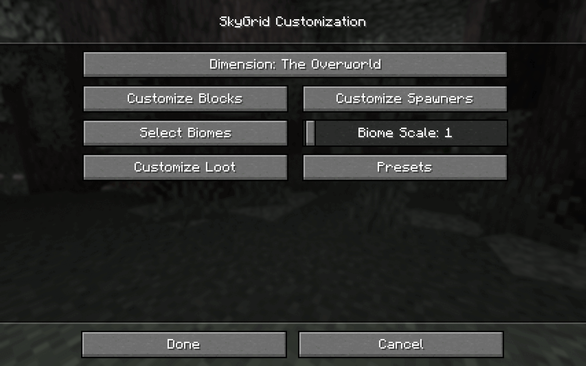

[modrinth]: https://modrinth.com/mod/skygrid-reloaded
[curseforge]: https://www.curseforge.com/minecraft/mc-mods/skygrid-reloaded

  
[][modrinth]
[][curseforge]

# About the mod

**SkyGrid Reloaded** is a mod that adds SkyGrid as a world preset. It is inspired by
SethBling's [original survival map](https://www.youtube.com/watch?v=5dhs3ithXDA) and has the following features:

* Customizable block weightings, chest loot and mob spawners with a client side UI.
* Several in-built presets.
* Locally savable custom presets.
* Core of mod is **server-side** - clients do not need the mod to connect to servers running SkyGrid worlds.
* Integrates well with modded blocks, items and entities.

